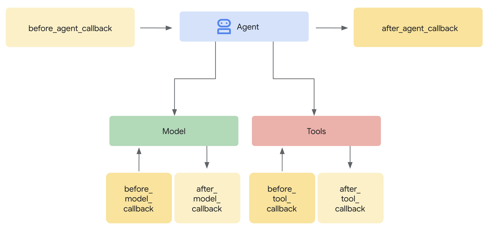

# Callbacks: Observe, Customize, and Control Agent Behavior

<div class="language-support-tag">
  <span class="lst-supported">Supported in ADK</span><span class="lst-python">Python v0.1.0</span><span class="lst-typescript">TypeScript v0.2.0</span><span class="lst-go">Go v0.1.0</span><span class="lst-java">Java v0.1.0</span><span class="lst-kotlin">Kotlin v0.1.0</span>
</div>

Callbacks are a cornerstone feature of ADK, providing a powerful mechanism to hook into an agent's execution process. They allow you to observe, customize, and even control the agent's behavior at specific, predefined points without modifying the core ADK framework code.

**What are they?** In essence, callbacks are standard functions that you define. You then associate these functions with an agent when you create it. The ADK framework automatically calls your functions at key stages, letting you observe or intervene. Think of it like checkpoints during the agent's process:

* **Before the agent starts its main work on a request, and after it finishes:** When you ask an agent to do something (e.g., answer a question), it runs its internal logic to figure out the response.
  * The `Before Agent` callback executes *right before* this main work begins for that specific request.
  * The `After Agent` callback executes *right after* the agent has finished all its steps for that request and has prepared the final result, but just before the result is returned.
  * This "main work" encompasses the agent's *entire* process for handling that single request. This might involve deciding to call an LLM, actually calling the LLM, deciding to use a tool, using the tool, processing the results, and finally putting together the answer. These callbacks essentially wrap the whole sequence from receiving the input to producing the final output for that one interaction.
* **Before sending a request to, or after receiving a response from, the Large Language Model (LLM):** These callbacks (`Before Model`, `After Model`) allow you to inspect or modify the data going to and coming from the LLM specifically.
* **Before executing a tool (like a Python function or another agent) or after it finishes:** Similarly, `Before Tool` and `After Tool` callbacks give you control points specifically around the execution of tools invoked by the agent.




**Why use them?** Callbacks unlock significant flexibility and enable advanced agent capabilities:

* **Observe & Debug:** Log detailed information at critical steps for monitoring and troubleshooting.
* **Customize & Control:** Modify data flowing through the agent (like LLM requests or tool results) or even bypass certain steps entirely based on your logic.
* **Implement Guardrails:** Enforce safety rules, validate inputs/outputs, or prevent disallowed operations.
* **Manage State:** Read or dynamically update the agent's session state during execution.
* **Integrate & Enhance:** Trigger external actions (API calls, notifications) or add features like caching.

!!! tip
    When implementing security guardrails and policies, use ADK Plugins for
    better modularity and flexibility than Callbacks. For more details, see
    [Callbacks and Plugins for Security Guardrails](/safety/#callbacks-and-plugins-for-security-guardrails).

**How are they added:**

??? "Code"
    === "Python"

        ```python
        --8<-- "examples/python/snippets/callbacks/callback_basic.py:callback_basic"
        ```

    === "TypeScript"

        ```typescript
        --8<-- "examples/typescript/snippets/callbacks/callback_basic.ts:callback_basic"
        ```

    === "Go"

        ```go
        --8<-- "examples/go/snippets/callbacks/main.go:imports"


        --8<-- "examples/go/snippets/callbacks/main.go:callback_basic"
        ```

    === "Java"

        ```java
        --8<-- "examples/java/snippets/src/main/java/callbacks/AgentWithBeforeModelCallback.java:init"
        ```

    === "Kotlin"

        ```kotlin
        --8<-- "examples/kotlin/snippets/callbacks/CallbackBasic.kt:callback_basic"
        ```

## The Callback Mechanism: Interception and Control

When the ADK framework encounters a point where a callback can run (e.g., just before calling the LLM), it checks if you provided a corresponding callback function for that agent. If you did, the framework executes your function.

**Context is Key:** Your callback function isn't called in isolation. The framework provides special **context objects** (`CallbackContext` or `ToolContext`) as arguments. These objects contain vital information about the current state of the agent's execution, including the invocation details, session state, and potentially references to services like artifacts or memory. You use these context objects to understand the situation and interact with the framework. (See the dedicated "Context Objects" section for full details).

**Controlling the Flow (The Core Mechanism):** The most powerful aspect of callbacks lies in how their **return value** influences the agent's subsequent actions. This is how you intercept and control the execution flow:

1. **`return None` (Allow Default Behavior):**

    * The specific return type can vary depending on the language. In Java, the equivalent return type is `Optional.empty()`. In Kotlin, it is `CallbackChoice.Continue(value)` (for `before_*` callbacks) or returning the original object (for `after_*` callbacks). Refer to the API documentation for language specific guidance.
    * This is the standard way to signal that your callback has finished its work (e.g., logging, inspection, minor modifications to input arguments) and that the ADK agent should **proceed with its normal operation**.
    * For `before_*` callbacks (`before_agent`, `before_model`, `before_tool`), returning `None` means the next step in the sequence occurs, whether that step is running the agent logic, calling the LLM, or executing the tool.
    * For `after_*` callbacks (`after_agent`, `after_model`, `after_tool`), returning `None` leaves the result just produced untouched, whether that result is the agent's output, the LLM's response, or the tool's result. In Python, returning that result back instead of `None` is not equivalent for `after_agent_callback`: ADK emits a second event carrying the same content.

2. **`return <Specific Object>` (Override Default Behavior):**

    * Returning a *specific type of object* (instead of signaling "Continue") is how you **override** the ADK agent's default behavior. In Kotlin, this is achieved by returning `CallbackChoice.Break(value)` (for `before_*` callbacks) or a replacement object (for `after_*` callbacks). The framework will use the object you return and *skip* the step that would normally follow or *replace* the result that was just generated.
    * **`before_agent_callback` → `Content`**: Skips the agent's main execution logic. The returned `Content` object is immediately treated as the agent's final output for this turn. Useful for handling simple requests directly or enforcing access control.
    * **`before_model_callback` → `LlmResponse`**: Skips the call to the external Large Language Model. The returned `LlmResponse` object is processed as if it were the actual response from the LLM. Ideal for implementing input guardrails, prompt validation, or serving cached responses.
    * **`before_tool_callback` → Python: `dict`, Kotlin: `Map<String, Any>`**: Skips the execution of the actual tool function (or sub-agent). The returned `dict` or `Map` is used as the result of the tool call, which is then passed back to the LLM. The behavior allows for validating tool arguments, applying policy restrictions, or returning mocked/cached tool results.
    * **`after_agent_callback` → `Content`**: *Appends* the returned `Content` as an additional event after the output the agent's run logic already produced. It does not replace that output; use `after_model_callback` to change a model response.
    * **`after_model_callback` → `LlmResponse`**: *Replaces* the `LlmResponse` received from the LLM. Useful for sanitizing outputs, adding standard disclaimers, or modifying the LLM's response structure.
    * **`after_tool_callback` → Python: `dict`, Kotlin: `Map<String, Any>`**: *Replaces* the result returned by the tool. Allows for post-processing or standardization of tool outputs before they are sent back to the LLM.

**Conceptual Code Example (Guardrail):**

This example demonstrates the common pattern for a guardrail using `before_model_callback`.

??? "Code"
    === "Python"

        ```python
        --8<-- "examples/python/snippets/callbacks/before_model_callback.py"
        ```

    === "TypeScript"
        ```typescript
        --8<-- "examples/typescript/snippets/callbacks/before_model_callback.ts"
        ```

    === "Go"
        ```go
        --8<-- "examples/go/snippets/callbacks/main.go:imports"


        --8<-- "examples/go/snippets/callbacks/main.go:guardrail_init"
        ```

    === "Java"
        ```java
        --8<-- "examples/java/snippets/src/main/java/callbacks/BeforeModelGuardrailExample.java:init"
        ```

    === "Kotlin"
        ```kotlin
        --8<-- "examples/kotlin/snippets/callbacks/BeforeModelCallback.kt:before_model_callback"
        ```

By understanding this mechanism of returning `None` versus returning specific objects, you can precisely control the agent's execution path, making callbacks an essential tool for building sophisticated and reliable agents with ADK.

